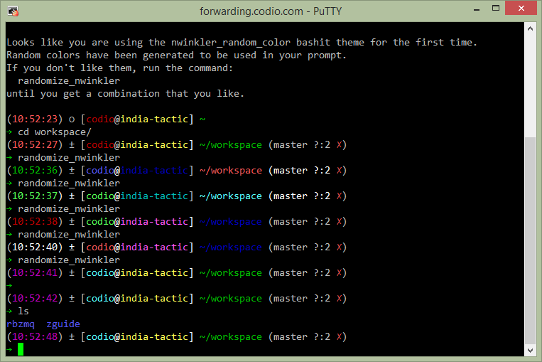

.. _nwinkler_random_color:

Nwinkler Random Color Theme
===========================

Description
-----------

The *Nwinkler Random Color* Theme is based on the :ref:`Nwinkler Theme <nwinkler_image>` , but it randomizes the colors for:

* time
* username
* hostname
* path

The random colors are chosen the first time this theme is used and saved to the ``~/.nwinkler_random_colors`` file. So, the next time you connect to the same machine, you will get the same colors.

To force new random colors to be selected, run the command:

.. code-block:: sh

   randomize_nwinkler

Screenshot
----------

Here it is in action:

Usage Scenario
--------------

This theme is especially useful when connecting to many different machines and switching between them often. Yes, the hostname *is* present in the prompt. But I argue that it's a lot faster to get a "feel" of what machine you are currently on because of the custom colors on that machine's prompt than by reading the hostname.
