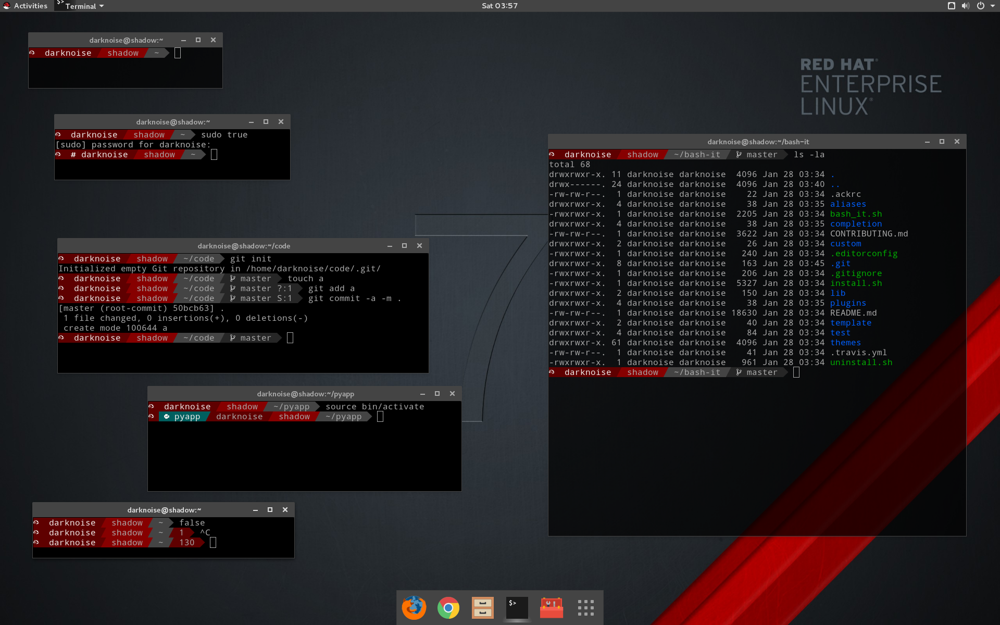

.. _redline:

Redline Theme
=============

changed up the powerline base a little.

It plays nicest with  this font: `DroidSansMonoForPowerline <https://github.com/ryanoasis/nerd-fonts/tree/master/patched-fonts/DroidSansMono>`_

Read the :ref:`powerline theme documentation <powerline>`

added
-----

* hostname
* distro logo

changed
-------

* sudo credential check
* required font
* some icons

Works real good like with:

.. code-block:: bash

   ## set the theme
   export BASH_IT_THEME='redline'

   # Set this to false to turn off version control status checking within the prompt for all themes
   export SCM_CHECK=true

   ## Set Xterm/screen/Tmux title with only a short hostname.
   export SHORT_HOSTNAME=$(hostname -s)

   ## enable sudo prompt
   export POWERLINE_PROMPT_USER_INFO_MODE="sudo"

   ## prompt part string
   export POWERLINE_PROMPT="python_venv user_info hostname cwd scm"

enable your distro logo with
----------------------------

.. code-block:: bash

   export POWERLINE_PROMPT_DISTRO_LOGO="yes"

